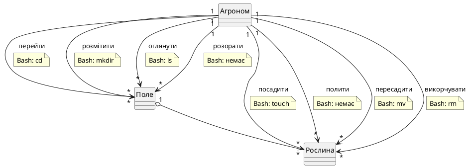

## Дисципліна "Операційні системи"

## Тема "Встановлення предметно-орієнтованих семантичних відповідностей між операціями предметної області та операціями базових Bash-команд керування файловою системою"

## Завдання для студентів 3-го курсу за спеціальністю "Інженерія програмного забезпечення"

---

### Етап 1. Визначення предметних аналогів базових об’єктів файлової системи

1. Проаналізувати наданий текстовий опис предметної області (ПрО).

2. Визначити сутності, які виконують роль:
   - класу-контейнера (Aggregate) — аналог каталогу;
   - класу-елемента (Part) — аналог файлу;
   - рольового класу (Actor) — актор ПрО.

3. Обґрунтовано визначити тип зв’язку між класом-контейнером та класом-елементом:
   - **композиція** — якщо елемент не може існувати поза контейнером, а видалення контейнера призводить до вилучення елемента;
   - **агрегація** — якщо елемент може існувати окремо від контейнера як самостійний об’єкт.

   **Примітка 1.** Bash-команда `rm -r` видаляє каталог разом із вмістом, що імітує композицію.

   **Примітка 2.** Якщо для контейнера передбачено видалення разом із вмістом (`rm -r`), доцільно обирати **композицію**, якщо тільки в ПрО не передбачено обов’язкове переміщення елементів перед видаленням контейнера.

   **Примітка 3.** Якщо обрано агрегацію, необхідно чітко пояснити, як каскадне видалення `rm -r` узгоджується з можливістю елемента існувати окремо. Наприклад: «елемент може бути переміщений в інший контейнер; якщо він не переміщений, `rm -r` знищує його як граничний випадок».

4. Спроєктувати UML-діаграму концептуальних класів ПрО, враховуючи, що:
   - дії над класом-контейнером треба перетворити на зв’язки-асоціації між рольовим класом та класом-контейнером;
   - дії над класом-елементом треба перетворити на зв’язки-асоціації між рольовим класом та класом-елементом.

5. Відобразити на діаграмі рольовий клас (Actor) як окремий клас та показати його зв’язки-асоціації з класом-контейнером і класом-елементом.

6. Вказати кратність зв’язків на кінцях **усіх** асоціацій (наприклад, `1`, `*`), включаючи асоціації за участю Actor.

---

### Етап 2. Визначення семантичних відповідників між операціями ПрО та Bash-командами

**Семантична відповідність** — це смислова близькість між дією ПрО та операцією Bash-команди. 
Дві операції вважаються близькими за змістом, якщо вони виконують ту саму дію над об’єктом того самого типу (наприклад, «створити файл» і «посадити рослину» — обидві означають появу нового елемента).

1. Розглянути опис базових операцій Bash-команд керування файловою системою:

| Bash-команда | Операція Bash-команди |
|---|---|
| `cd` | перейти у каталог |
| `mkdir` | створити каталог |
| `touch` | створити файл |
| `nano` | змінити файл |
| `ls` | переглянути каталог |
| `cat` | переглянути файл |
| `mv` | перемістити каталог або файл |
| `cp -r` | створити копію каталогу |
| `cp` | створити копію файлу |
| `rmdir` | видалити порожній каталог |
| `rm -r` | видалити каталог |
| `rm` | видалити файл |

2. Для кожної операції Bash-команди визначити, об’єкт якого типу класу вона обробляє — контейнер чи елемент.

   **Правило вибору типу класу:**
   - якщо Bash-команда за змістом призначена лише для каталогів — вона розглядається тільки для Aggregate;
   - якщо лише для файлів — тільки для Part;
   - якщо команда може працювати з обома типами (наприклад, `mv`), вона розглядається окремо для кожного типу, якщо в ПрО є відповідні дії.

3. Визначити розбіжність за змістом між діями ПрО та операціями Bash-команд:
   - визначити одну дію над класом-контейнером (Aggregate), яка **НЕ має** відповідника за змістом серед наведених 12 Bash-команд;
   - визначити одну дію над класом-елементом (Part), яка **НЕ має** відповідника за змістом серед наведених 12 Bash-команд.

   **Критерій визначення дії без відповідника:** дія не має відповідника, якщо жодна з 12 Bash-команд не виконує близьку за змістом операцію над об’єктом відповідного типу.

   **Приклади:**
   - «розорати» (Aggregate) — немає команди, що змінює фізичний стан контейнера;
   - «полити» (Part) — немає команди, що змінює стан елемента без зміни його вмісту.

   Вибір дії без відповідника має бути обґрунтований у таблиці.

4. Для кожної операції Bash-команди, яка обробляє об’єкт типу контейнер, підібрати дію ПрО з переліку назв зв’язків-асоціацій між рольовим класом та класом-контейнером, яка **відповідає їй за змістом**.

5. Для кожної операції Bash-команди, яка обробляє об’єкт типу елемент, підібрати дію ПрО з переліку назв зв’язків-асоціацій між рольовим класом та класом-елементом, яка **відповідає їй за змістом**.

6. Під час зіставлення дій ПрО з Bash-командами застосовувати такі обов’язкові правила.

   **Правило 1. Пріоритет Bash-команд для дій над елементом (Part).**
   Якщо дія над елементом може бути зіставлена з кількома Bash-командами, пріоритет надається в такому порядку:
   - `touch` — поява нового елемента;
   - `nano` — зміна вмісту наявного елемента;
   - `cat` — перегляд вмісту елемента;
   - `cp` — створення копії елемента;
   - `mv` — переміщення елемента;
   - `rm` — видалення елемента.

   Якщо дія вже зіставлена з командою, що має вищий пріоритет, вона не може бути зіставлена з командою, що має нижчий пріоритет.

   **Правило 2. Розмежування `touch` і `nano`.**
   `touch` використовується для дій, що означають **появу нового елемента** (створити, зареєструвати, додати, внести, завести, встановити, посадити, висадити, написати, накреслити, виготовити, скласти, замовити, відзняти, записати, отримати, підготувати, провести, оформити).
   `nano` використовується для дій, що означають **зміну вмісту вже наявного елемента** (відредагувати, виправити, доповнити, уцінити, змастити, озвучити, аранжувати, інтерпретувати, відкалібрувати, пофарбувати, затаврувати, описати, завірити, сертифікувати, полакувати, заламінувати, викроїти, відкоригувати).
   Якщо дія може бути потрактована і як створення, і як зміна, слід керуватися контекстом ПрО: якщо елемент уже існує — `nano`, якщо щойно з’являється — `touch`.

   **Правило 3. Розмежування `ls` і `cat`.**
   `ls` використовується для дій над контейнером, що означають **огляд вмісту контейнера** (оглянути, обстежити, інспектувати, звірити, переглянути каталог).
   `cat` використовується для дій над елементом, що означають **перегляд вмісту елемента** (прочитати, перевірити, вивчити, прослухати, протестувати, дослідити, переглянути файл).
   Якщо дія над елементом за змістом ближча до «переглянути вміст», використовується `cat`; якщо дія над контейнером — `ls`.

   **Правило 4. Вибір дії без відповідника.**
   Якщо в ПрО є кілька дій, які можуть претендувати на роль «без відповідника» (тобто жодна з 12 Bash-команд не виконує близьку за змістом операцію), обирається **перша за порядком згадування** в тексті опису ПрО.
   Для кожної ПрО обирається **рівно одна** дія без відповідника над контейнером і **рівно одна** — над елементом.

   **Примітка. Розмежування `cp`/`cp -r` і `rmdir`/`rm -r`.**
   `cp` використовується для копіювання елемента, `cp -r` — для копіювання контейнера.
   `rmdir` використовується для видалення порожнього контейнера, `rm -r` — для видалення контейнера разом із вмістом.
   Якщо в ПрО немає відповідної дії, команда позначається в таблиці як «—».

7. Перевірити однозначність: різні операції Bash-команд не повинні мати однакові дії ПрО.

   **Правило розв’язання неоднозначності:** якщо дія ПрО може бути зіставлена з кількома Bash-командами, слід обрати ту, яка найточніше відображає зміст дії в контексті ПрО, і обґрунтувати вибір у таблиці.

8. Сформувати таблицю зі стовпчиками: **"Операція ПрО"**, **"Операція Bash-команди"**, **"Bash-команда"**, **"Обґрунтування вибору"**.

   **Правила заповнення:**
   - команди в таблиці наводити в порядку, наведеному в базовому наборі з 12 Bash-команд;
   - **таблиця має містити 12 рядків — по одному для кожної Bash-команди з базового набору**, у порядку їх наведення;
   - у стовпчику "Операція Bash-команди" для дій без відповідника писати «—»;
   - у стовпчику "Bash-команда" для дій без відповідника писати «—»;
   - у стовпчику "Обґрунтування вибору" пояснити, чому саме ця дія має або не має відповідника;
   - **якщо Bash-команда не має відповідної дії ПрО**, у стовпчику "Операція ПрО" писати «—», а в "Обґрунтування вибору" пояснити, чому відповідника немає.

   **Примітка 1.** Кількість встановлених відповідностей залежить від тексту опису ПрО.

   **Примітка 2.** Не всі 12 Bash-команд можуть мати відповідник у конкретній ПрО. Відсутність відповідника фіксується в таблиці як «—».

   **Примітка 3.** Використовуються лише ті Bash-команди, для яких у ПрО є близькі за змістом дії.

   **Орієнтовні відповідності для команд, які не завжди мають відповідник:**
   - `nano` — дія, що змінює вміст елемента (наприклад, «відредагувати»);
   - `cat` — дія, що переглядає вміст елемента (наприклад, «прочитати»);
   - `cp` — дія, що створює копію елемента (наприклад, «продублювати»);
   - `cp -r` — дія, що створює копію контейнера (наприклад, «скопіювати каталог»);
   - `rmdir` — дія, що видаляє порожній контейнер (наприклад, «звільнити каталог»);
   - `rm -r` — дія, що видаляє контейнер разом із вмістом.

   **Примітка 4.** `rmdir` використовується, якщо в ПрО є дія, що видаляє порожній контейнер; `rm -r` — якщо дія видаляє контейнер разом із вмістом. Для більшості ПрО `rm -r` є більш доречним, ніж `rmdir`.

---

### Етап 3. Розробка UML-діаграми концептуальних класів ПрО

1. Спроєктувати UML-діаграму концептуальних класів для всієї ПрО, яка містить рольовий клас (Actor), клас-контейнер (Aggregate) і клас-елемент (Part) та всі зв’язки-асоціації між ними.

2. Реалізувати UML-діаграму концептуальних класів у форматі мови розмітки PlantUML.

   Для фіксації відповідності між зв’язком-асоціацією та Bash-командою використати UML-коментар (Comment / Note), приєднаний до відповідної асоціації.

   Згідно зі стандартом OMG UML, коментар є окремим елементом моделі, який приєднується до будь-якого елемента пунктирною лінією та містить довільний текстовий опис без впливу на семантику самої моделі. У PlantUML це реалізується конструкцією `note on link … end note`.

3. Для дій, які не мають семантичного відповідника серед наведених 12 Bash-команд, у коментарі до зв’язку зазначити `Bash: немає`.

4. Зберегти результат у файлі `Domain.puml`, де `Domain` — скорочена однословна назва ПрО у транслітерації.

   **Примітка.** У всіх частинах завдання та в контрольному списку використовується **єдина** назва файлу — `Domain.puml`.

5. Перевірити коректність візуалізації UML-діаграми, яку створено у форматі мови розмітки PlantUML, використовуючи Online-редактор PlantUML - https://www.planttext.com/
   
---

### Етап 4. Створення псевдонімів

1. Для кожної асоціації, позначеної на UML-діаграмі та реалізованої через Bash-команду, створити псевдонім `alias`, який зв’язує предметно-орієнтовану назву дії ПрО з відповідною базовою Bash-командою.

   **Примітка.** Для дій, позначених у PlantUML як `Bash: немає`, псевдоніми не створюються.

2. Записати псевдоніми у форматі:
   ```bash
   alias <назва_дії_ПрО_транслітерацією>='<Bash-команда>'
   ```
3. Перевірити кожен псевдонім на виконання: після його створення виконати предметно-орієнтовану команду та переконатися, що Bash-оболонка інтерпретує її як відповідну базову команду.
Приклад:
   ```bash
   alias rozmittyty='mkdir'
   rozmittyty pole   # має створити каталог pole
   ```
4. Зберегти створені псевдоніми у файл Domain_aliases.sh, де Domain — скорочена однословна назва ПрО у транслітерації.

## Контрольний список критеріїв оцінювання:

1. Визначено рольовий клас (Actor), клас-контейнер (Aggregate) та клас-елемент (Part) з обґрунтуванням вибору кожної сутності відповідно до тексту опису предметної області.

2. Обґрунтовано тип зв’язку між класом-контейнером і класом-елементом (композиція або агрегація) з поясненням, яке узгоджується з Bash-командою rm -r та можливістю елемента існувати окремо.

3. Вказано кратність зв’язків на кінцях усіх асоціацій (наприклад, 1, 0..1, 1..*, *) та пояснено її відповідно до тексту опису ПрО.

4. Встановлено відповідності між діями ПрО та операціями Bash-команд без дублювання: різні операції Bash-команд мають різні дії ПрО.

6. Визначено дві дії без семантичного відповідника — по одній над класом-контейнером (Aggregate) і над класом-елементом (Part); у таблиці вони позначені «—», у PlantUML — коментарем Bash: немає.

7. Таблиця відповідностей містить усі обов’язкові стовпчики («Операція ПрО», «Операція Bash-команди», «Bash-команда», «Обґрунтування вибору») та заповнена для кожного рядка, включно з діями без відповідника. Таблиця містить 12 рядків — по одному для кожної Bash-команди з базового набору.

8. PlantUML-код синтаксично коректний, містить усі класи, зв’язки-асоціації та кратність, для фіксації Bash-команд використано конструкцію note on link … end note, а результат збережено у файлі Domain.puml, де Domain — скорочена однословна назва ПрО у транслітерації.

9. Перевірено коректність візуалізації UML-діаграми, яку створено у форматі мови розмітки PlantUML, використовуючи Online-редактор PlantUML - https://www.planttext.com/

10. Для кожної асоціації, позначеної на UML-діаграмі та реалізованої через Bash-команду, створено псевдонім `alias`, який зв’язує предметно-орієнтовану назву дії ПрО з відповідною базовою Bash-командою.

11. Всі описи всевдонімів збережено у файлі Domain_aliases.sh, де Domain — скорочена однословна назва ПрО у транслітерації.
 

## Приклад виконання завдання

### Предметна область: «Рослинництво»

**Текстовий опис ПрО:**
> Агроном має розмітити поле, перейти на нього, оглянути та розорати. Потім він має посадити рослину, полити її, пересадити, а за потреби — викорчувати.

---

### Етап 1. Визначення предметних аналогів базових об’єктів файлової системи

| UML-роль | Сутність ПрО | Обґрунтування |
|---|---|---|
| Actor (рольовий клас) | Агроном | Виконує дії над полем і рослиною |
| Aggregate (клас-контейнер) | Поле | Містить рослини як свої елементи; аналог каталогу |
| Part (клас-елемент) | Рослина | Належить полю; аналог файлу |

**Тип зв’язку між полем і рослиною — агрегація.**

**Обґрунтування:** рослину можна пересадити в інше поле (`mv`), тобто вона існує окремо від контейнера. Каскадне видалення `rm -r` є граничним випадком, коли поле знищується разом із рослинами, не пересаджуючи їх.

**Узгодження:** у моделі ПрО пересаджування рослини (`mv`) відображає можливість елемента існувати окремо, а каскадне видалення `rm -r` трактується як граничний випадок, коли агроном знищує поле разом із рослинами, не пересаджуючи їх.

---

### Етап 2. Визначення семантичних відповідників між операціями ПрО та Bash-командами

| Операція ПрО | Операція Bash-команди | Bash-команда | Обґрунтування вибору |
|---|---|---|---|
| перейти | перейти у каталог | `cd` | семантичний синонім: пряме значення |
| розмітити | створити каталог | `mkdir` | семантичний синонім: розмітка поля = створення контейнера |
| посадити | створити файл | `touch` | семантичний синонім: поява нового елемента |
| — | змінити файл | `nano` | немає відповідника: у ПрО немає дії, що змінює вміст елемента |
| оглянути | переглянути каталог | `ls` | семантичний синонім: огляд вмісту поля |
| — | переглянути файл | `cat` | немає відповідника: у ПрО немає дії, що переглядає вміст елемента |
| пересадити | перемістити файл | `mv` | семантичний синонім: зміна розташування елемента |
| — | створити копію каталогу | `cp -r` | немає відповідника: у ПрО немає дії, що створює копію контейнера |
| — | створити копію файлу | `cp` | немає відповідника: у ПрО немає дії, що створює копію елемента |
| — | видалити порожній каталог | `rmdir` | немає відповідника: у ПрО немає дії, що видаляє порожній контейнер |
| розорати | — | — | немає відповідника: дія над контейнером без Bash-аналога |
| полити | — | — | немає відповідника: дія над елементом без Bash-аналога |

**Примітка.** Оскільки `розорати` і `полити` не мають Bash-команд, вони додані як додаткові рядки після 12 основних.

**Перевірка однозначності:** різні операції Bash-команд мають різні дії ПрО. Дублювання відсутнє.

---

### Етап 3. Розробка UML-діаграми концептуальних класів ПрО

**Фрагмент PlantUML-коду (файл `Roslynnyctvo.puml`):**



### Етап 4. Створення псевдонімів

Для кожної асоціації, позначеної на UML-діаграмі та реалізованої через Bash-команду, створюються псевдоніми.

#### Відповідники, які реалізуються через alias

| Операція ПрО | Bash-команда | Псевдонім |
|---|---|---|
| перейти | `cd` | `alias pereyty='cd'` |
| розмітити | `mkdir` | `alias rozmittyty='mkdir'` |
| посадити | `touch` | `alias posadyty='touch'` |
| оглянути | `ls` | `alias oglyanuty='ls'` |
| пересадити | `mv` | `alias peresadyty='mv'` |
| викорчувати | `rm` | `alias vykorchuvaty='rm'` |

**Примітка.** Для дій `розорати` і `полити`, позначених як `Bash: немає`, псевдоніми не створюються.


### Перевірити виконання предметно-орієнтованих команд, наприклад:
```bash
pereyty pole
rozmittyty pole
posadyty roslyna
oglyanuty pole
peresadyty roslyna pole2
vykorchuvaty roslyna
```

## Текстові описи предметних областей

### Варіант 1. «Бібліотечна справа»

Бібліотекар має задекорувати полицю, підійти до полиці, облаштувати полицю та оглянути полицю. Для роботи з книгою слід зареєструвати книгу, прочитати книгу, перекласти книгу та оцифрувати книгу.

### Варіант 2. «Екологія та лісництво»

Лісничий має охороняти ділянку, підійти до ділянку, розмітити ділянку та обстежити ділянку. Для роботи з деревом слід висадити дерево, оглянути дерево, пересадити дерево та затаврувати дерево.

### Варіант 3. «Складська логістика»

Комірник має застрахувати стелаж, підійти до стелажа, змонтувати стелаж та інспектувати стелаж. Для роботи з коробкою слід зареєструвати коробку, розкрити коробку, переставити коробку та зважити коробку.

### Варіант 4. «Ресторанна справа»

Шеф-кухар має оформити меню, підійти до меню, сформувати меню та оглянути меню. Для роботи зі стравою слід приготувати страву, перевірити страву, перенести страву та дегустувати страву.

### Варіант 5. «Медична клініка»

Лікар має заліцензувати картку, підійти до картки, завести картку та оглянути картку. Для роботи з аналізом слід внести аналіз, вивчити аналіз, продублювати аналіз та інтерпретувати аналіз.

### Варіант 6. «Музейна справа»

Куратор має освітлювати зал, увійти до залу, підготувати зал та оглянути зал. Для роботи з експонатом слід встановити експонат, описати експонат, переставити експонат та застрахувати експонат.

### Варіант 7. «Автомайстерня»

Автомеханік має провітрювати бокс, зайти в бокс, обладнати бокс та оглянути бокс. Для роботи з деталлю слід виготовити деталь, протестувати деталь, замінити деталь та пофарбувати деталь.

### Варіант 8. «Фінанси та бухгалтерія»

Бухгалтер має затвердити кошторис, звернутися до кошторису, сформувати кошторис та звірити кошторис. Для роботи з транзакцією слід провести транзакцію, вивчити транзакцію, перенести транзакцію та завірити транзакцію.

### Варіант 9. «Музична індустрія»

Звукорежисер має презентувати альбом, увійти до альбому, скомпонувати альбом та оглянути альбом. Для роботи з треком слід записати трек, прослухати трек, дублювати трек та аранжувати трек.

### Варіант 10. «Транспортна логістика»

Диспетчер має опломбувати вагон, підійти до вагона, підготувати вагон та оглянути вагон. Для роботи з вантажем слід оформити вантаж, перевірити вантаж, переставити вантаж та зважити вантаж.

### Варіант 11. «Спорт та фітнес»

Тренер має анонсувати програму, підійти до програми, скласти програму та оглянути програму. Для роботи з вправою слід розробити вправу, перевірити вправу, переставити вправу та продемонструвати вправу.

### Варіант 12. «Видавнича справа»

Редактор має заліцензувати рубрику, підійти до рубрики, заснувати рубрику та оглянути рубрику. Для роботи зі статтею слід написати статтю, відредагувати статтю, продублювати статтю та проілюструвати статтю.

### Варіант 13. «Космічна станція»

Космонавт має розгерметизувати модуль, увійти до модуля, змонтувати модуль та оглянути модуль. Для роботи з приладом слід скласти прилад, перевірити прилад, переставити прилад та відкалібрувати прилад.

### Варіант 14. «Електронна торгівля»

Менеджер має прорекламувати каталог, увійти до каталогу, сформувати каталог та оглянути каталог. Для роботи з товаром слід додати товар, перевірити товар, переставити товар та уцінити товар.

### Варіант 15. «Авіація та аеропорт»

Авіатехнік має знежирити ангар, зайти в ангар, спорудити ангар та оглянути ангар. Для роботи з вузлом слід замовити вузол, перевірити вузол, замінити вузол та змастити вузол.

### Варіант 16. «Банківська справа»

Касир має опечатати сейф, підійти до сейфа, облаштувати сейф та оглянути сейф. Для роботи з банкнотою слід зареєструвати банкноту, перевірити банкноту, перекласти банкноту та утилізувати банкноту.

### Варіант 17. «Кіновиробництво»

Режисер має затінити сцену, підійти до сцени, заснувати сцену та оглянути сцену. Для роботи з дублем слід відзняти дубль, перевірити дубль, продублювати дубль та озвучити дубль.

### Варіант 18. «Швейне ательє»

Закрійник має освітлювати стенд, підійти до стенду, змонтувати стенд та оглянути стенд. Для роботи з лекалом слід накреслити лекало, відкоригувати лекало, перекласти лекало та викроїти лекало.

### Варіант 19. «Готельний бізнес»

Адміністратор має оздобити поверх, підійти до поверху, сформувати поверх та оглянути поверх. Для роботи з номером слід зареєструвати номер, перевірити номер, переставити номер та зарезервувати номер.

### Варіант 20. «IT-розробка»

Розробник має заархівувати репозиторій, увійти до репозиторію, ініціалізувати репозиторій та оглянути репозиторій. Для роботи з файлом слід завести файл, відредагувати файл, переставити файл та закоммітити файл.

### Варіант 21. «Архітектура»

Архітектор має заламінувати план, підійти до плану, розробити план та оглянути план. Для роботи з кресленням слід виконати креслення, виправити креслення, продублювати креслення та завірити креслення.

### Варіант 22. «Юриспруденція (Суд)»

Юрист має опечатати провадження, увійти до провадження, сформувати провадження та оглянути провадження. Для роботи з документом слід підготувати документ, вивчити документ, продублювати документ та завірити документ.

### Варіант 23. «Картографія та геодезія»

Геодезист має відкалібрувати планшет, підійти до планшета, розгорнути планшет та оглянути планшет. Для роботи з картою слід накреслити карту, доповнити карту, перекласти карту та заламінувати карту.

### Варіант 24. «Поліграфія»

Друкар має застрахувати тираж, підійти до тиражу, сформувати тираж та оглянути тираж. Для роботи з відбитком слід отримати відбиток, перевірити відбиток, продублювати відбиток та полакувати відбиток.

### Варіант 25. «Фармацевтика»

Провізор має продезінфікувати витрину, підійти до витрини, обладнати витрину та оглянути витрину. Для роботи з ліками слід замовити ліки, перевірити ліки, перекласти ліки та сертифікувати ліки.

